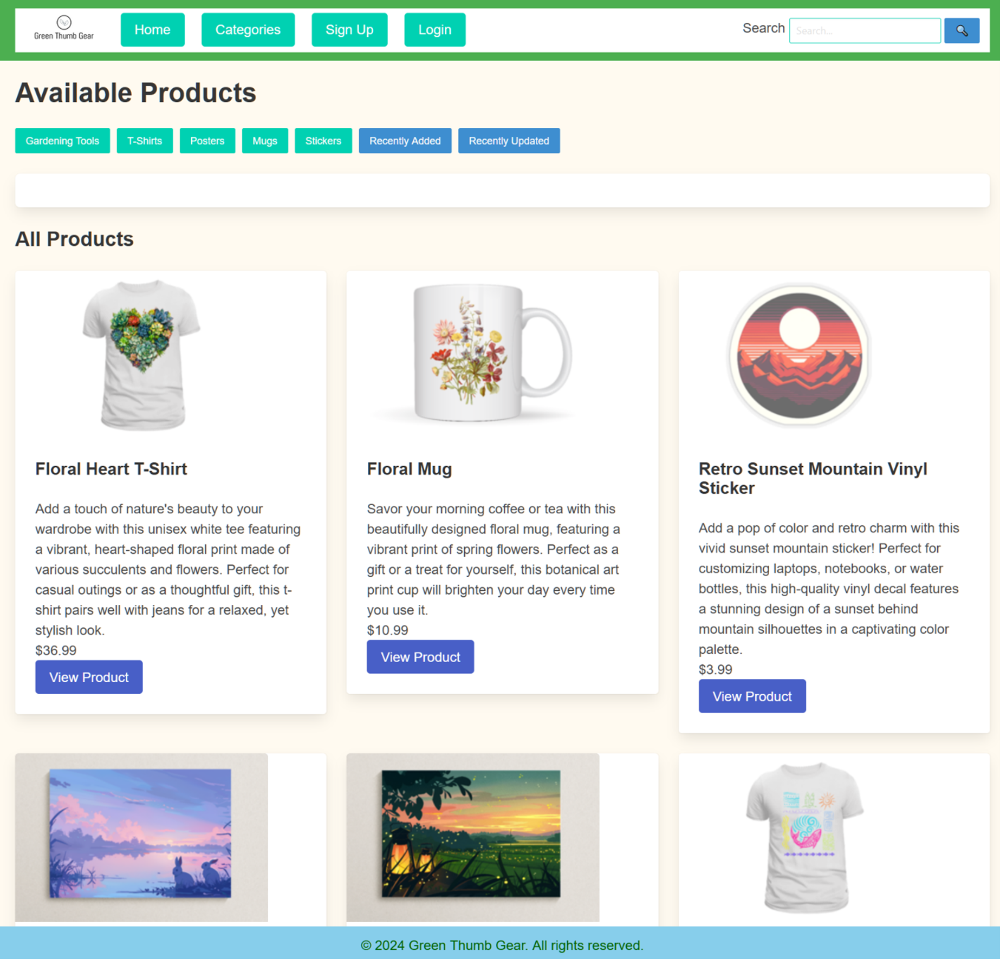
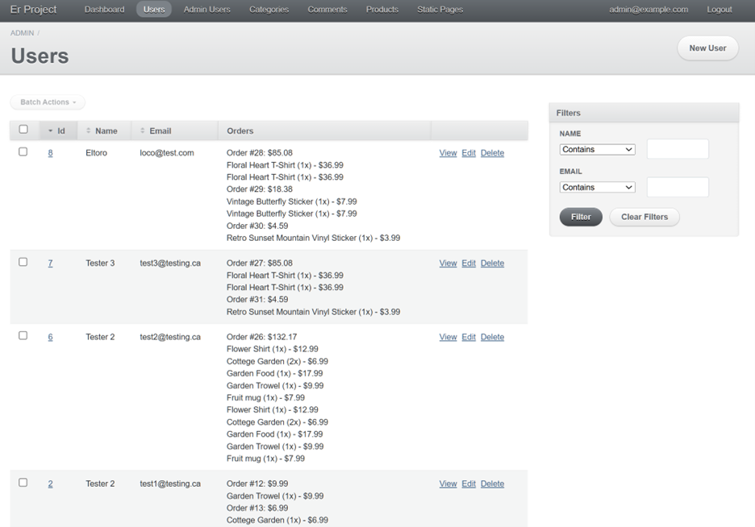
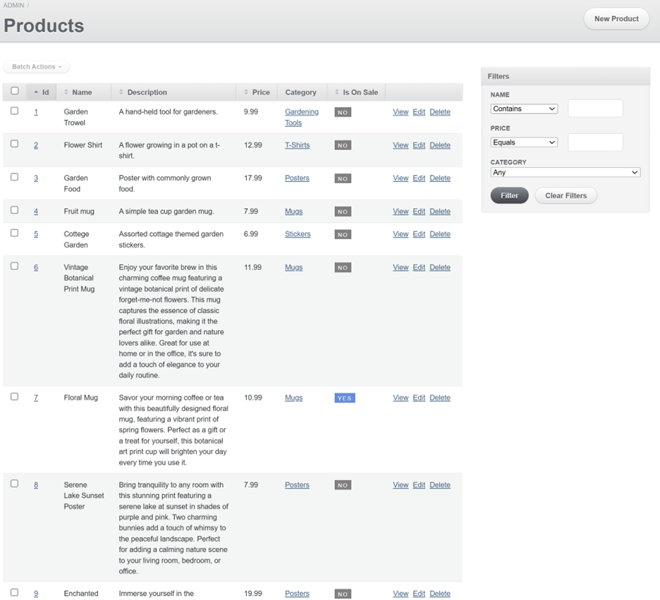
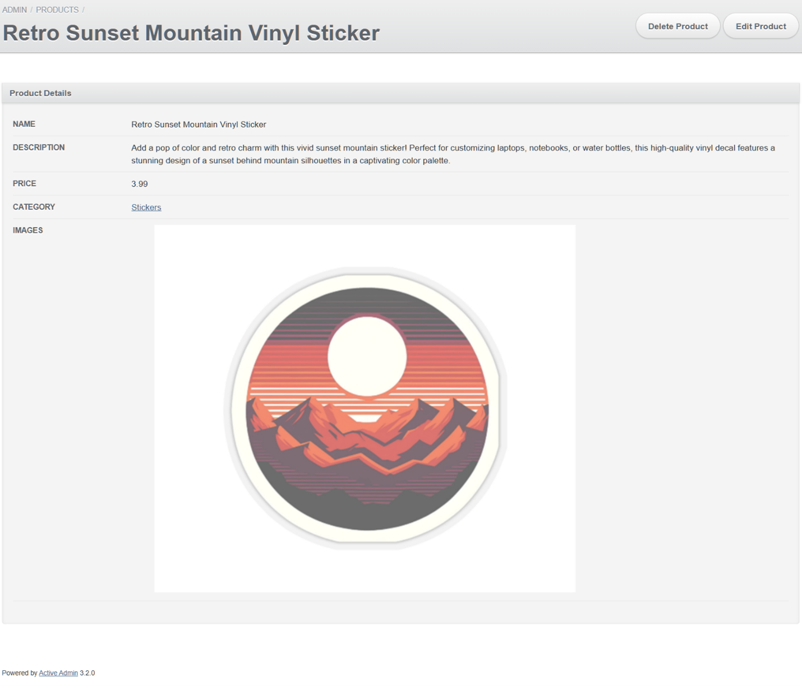
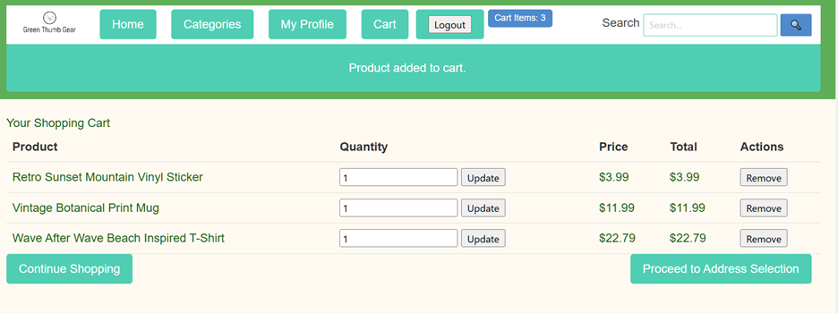
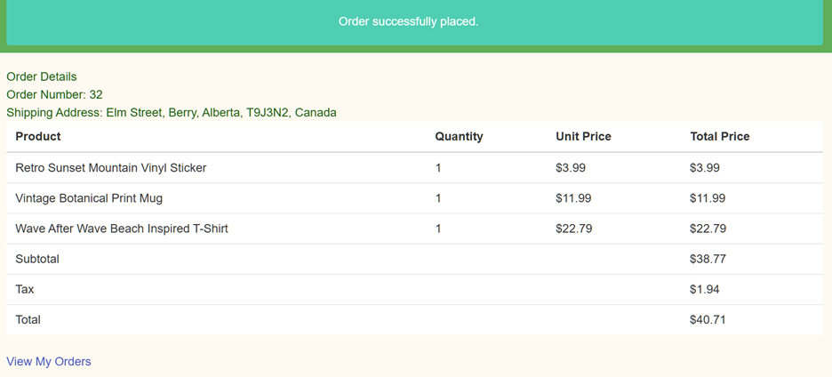

# E-Commerce Web Application for Online Shopping
This e-commerce platform is designed to provide a 
comprehensive online shopping experience. It allows users to browse 
products, manage their shopping cart, and proceed through a 
secure checkout process. The application is built with a focus 
on responsive design for a seamless experience across various devices.

## Features
- **Product Management**: Add, edit, and remove products with ease. Each product can have multiple images and belong to different categories.
- **Shopping Cart**: Users can add items to their cart, adjust quantities, and remove items as needed.
- **Checkout Process**: A secure checkout process that handles various payment methods and integrates address selection for shipping.
- **User Accounts**: Users can create accounts to manage their orders, view order history, and save shipping information.
- **Responsive Design**: Utilizes Bulma CSS for a responsive layout that adapts to mobile phones, tablets, and desktops.

## Technologies Used
- **Backend**: Ruby on Rails
- **Database**: PostgreSQL
- **Frontend**: HTML5, SASS, JavaScript, and Bulma CSS
- **Version Control**: Git

## Database Structure
The database manages several core functionalities, including users, products, orders, and more. Key tables include:

* **users**: Stores user information and authentication data.
* **products**: Contains details about the products including name, description, price, and stock.
* **orders**: Tracks order history, status, and associated products.
* **addresses**: Manages shipping and billing addresses for users.

## Screenshots
**Homepage**:



**Admin Dashboard - Users**:



**Admin Dashboard - Products**:



**Admin Dashboard - Product Page**:



**Shopping Cart**:



**Completed Order**:



## Installation Requirements and Setup Guide

### Prerequisites:
- **Ruby**: The project uses Ruby version 3.2.3. You can manage multiple Ruby versions using 
a version manager like `rbenv` or `rvm`.
- **Rails**: The application is built with Rails version 7.1.3.
- **PostgreSQL**: Check that you have PostgreSQL installed and running.
- **Node.js and Yarn**: Required for managing and building JavaScript dependencies.
- **Bundler**: Used for managing Ruby gem dependencies. Install with `gem install bundler`.
- **ImageMagick**: Needed for image processing features in the app.

### Environment Setup:
Before starting the setup, ensure your environment variables are properly configured 
as outlined in `.env` or `config/database.yml`.

### Steps to Install and Run:

1. **Install Dependencies**:
Run the following commands to install Ruby and JavaScript dependencies:
 ```
gem install bundler

bundle install

yarn install
 ```
2. **Database Preparation**:
Load the database schema and initial data:
 ```
psql -U postgres -d er_project_development -f outputfile.sql

rails db:migrate

rails db:seed
 ```

3. **Build Assets**:
Compile JavaScript assets using Yarn:
 ```
yarn run build
 ```

4. **Start the Server**:
Launch the Rails server:
 ```
rails s
 ```

### Handling Server Crashes and PID Files:
If the server crashes and a PID file prevents restarting, try the following:
1. Delete the PID file located at `tmp/pids/server.pid`.
2. Restart the server.

### Troubleshooting:
- Check that all your prerequisites are correctly installed and accessible from your command line.
- Check that your PostgreSQL server is running before loading the database.